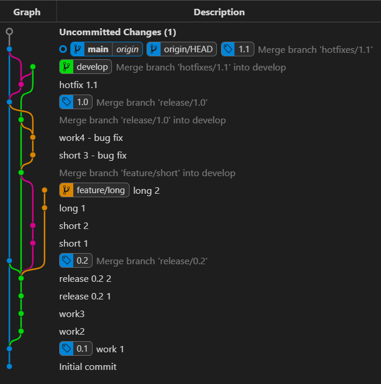

# gitflow

gitflow 정리


브랜치를 master, develop, feature, release, hotfixes로 구분해서 저장소를 운영합니다.
master에는 완성된 버전만이 속해야 합니다. 언제나 실행 가능해야 합니다. 실제 개발은 develop에서 진행합니다. 신규 기능은 'feature/기능명'으로 구분해서 쉽게 버릴 수 있도록 하고 있습니다. 출시 준비는 'release/버전명'에서 진행하고 준비가 끝나면 master로 병합합니다. 긴급 수정사항은 'hotfixes/차기버전명'을 이용합니다.

---

## 실습

```
git add .
git checkout -b develop
git tag 0.1

git checkout develop
git add .
git commit -m "work3"

git checkout -b release/0.2
git add .
git commit -m "release 0.2 1"
git add .
git commit -m "release 0.2 2"

git checkout develop
git merge release/0.2

git checkout main
git merge --no-ff release/0.2
git branch -d release/0.2
git tag 0.2

git branch feature/short
git add .
git commit -am "short 1"
git commit -am "short 2"

git checkout feature/long
git add .
git commit -m "long 1"

git checkout develop
git merge --no-ff  feature/short
git branch -d feature/short

git checkout -b release/1.0
git add .
git commit -m "short 3 - bug fix"
git add .
git commit -m "work4 - bug fix"

git checkout develop
git merge --no-ff release/1.0

git checkout main
git merge --no-ff release/1.0

git tag 1.0
git branch -d release/1.0

git add .
git commit -m "hotfix 1.1"

git checkout develop
git merge --no-ff hotfixes/1.1

git checkout main
git merge --no-ff hotfixes/1.1
git tag 1.1
git branch -d hotfixes/1.1
```


